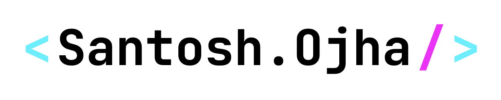

<h1 align="center">

  ">
  
</h1>

---

- 👋 Hi, I’m Santosh @santoshe61
- You can call me "Principal Full Stack JavaScript Engineer" and A Poet 
- 👀 I’ve plenty of experience in ...      JS (Vanilla, Vue, Nuxt, React, Next, Svelte, Node, jQuery, Quasar, ...rest), AWS, HTML, CSS, php, MySQL, Mongo and ofcourse Vitamin SHE 😜
- 👀 Worked with CMS/Tools like ... AEM, Pega, Contentful, Strapi, Sanity, Docker, GIT
- 🌱 I’m currently learning ... AWS, Java, Python, Azure
- 💞️ I’m looking to collaborate on ... Web Technologies
- 📫 How to reach me ...        Drop a mail at santoshE61@gmail.com or go through my portfolio at <https://santosh.top>

<!---
santoshe61/santoshe61 is a ✨ special ✨ repository because its `README.md` (this file) appears on your GitHub profile.
You can click the Preview link to take a look at your changes.
--->

---

#### 🔗 Links

* Portfolio: https://santosh.top
* GitHub: https://github.com/santoshe61
* LinkedIn: https://linkedin.com/in/santoshe61
* X (Twitter): https://x.com/santoshe61
* Key Open Source Projects:
  - Open-source, GDPR-compliant Cookie Consent + Consent Management Platform. [consenti](https://github.com/santoshe61/consenti)
  - Lightweight Web URLs Scrapper. [web-scrapper](https://github.com/santoshe61/web-scrapper)
  - Chrome extension to insert CSS & JS in page before load. [insert-js-css](https://github.com/santoshe61/insert-js-css)

---
